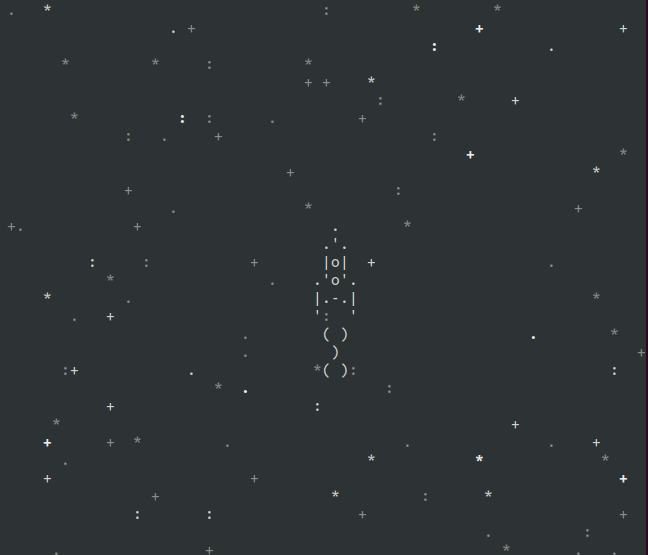

# Игра про космос

Ракета мирно летит по сверкающему звёздами космосу, управляется стрелками на клавиатуре.

Выглядит так:




## Как запустить

Для запуска сайта вам понадобится Python третьей версии.

Скачайте код с GitHub. Игра не требует устанавливать зависимости.
Запустите

```bash
python3 main.py
```

## Цели проекта

Код написан в учебных целях на курсе по Python и веб-разработке на сайте [Devman](https://dvmn.org).